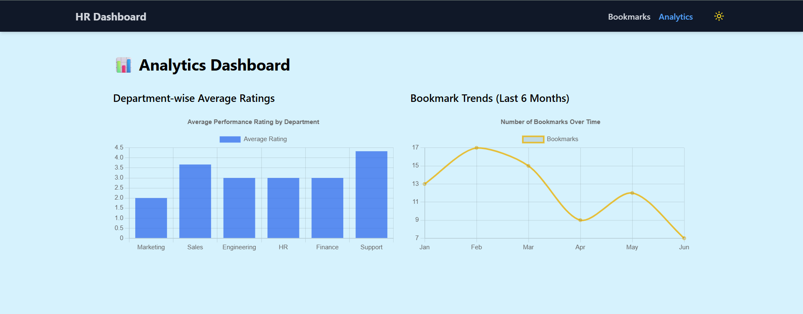
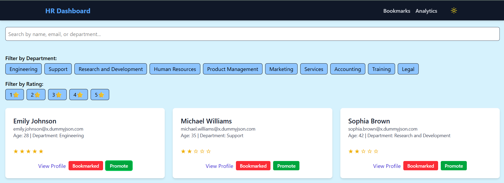
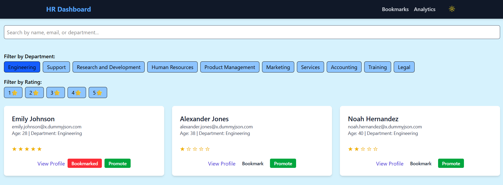
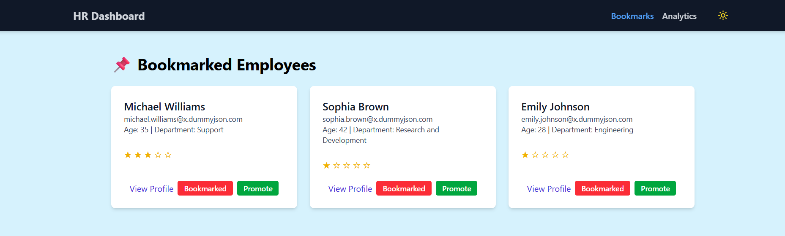
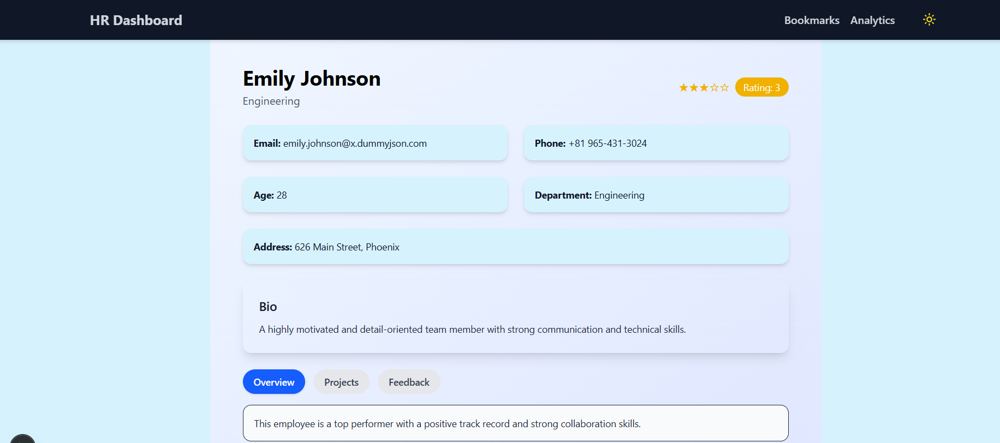

# 🧑‍💼 HR Dashboard (Advanced)

An advanced HR Performance Dashboard for HR Managers to track employee performance, view detailed profiles, manage bookmarks, and visualize performance analytics.

## 🔧 Tech Stack

- **Framework:** [Next.js App Router](https://nextjs.org/docs/app)
- **Styling:** [Tailwind CSS](https://tailwindcss.com/)
- **Language:** JavaScript (ES6+)
- **State Management:** Context API
- **Optional Integrations:** 
  - Charting: [Chart.js](https://www.chartjs.org/) (via react-chartjs-2)

---

## 🚀 Getting Started

### 📦 Installation

```bash
git clone https://github.com/mohith0407/flam.git
cd hr-dashboard
npm install
```

### ▶️ Run the Development Server

```bash
npm run dev
```

Navigate to `http://localhost:3000` to see the app.

---

## 🧭 Features Overview

### 1. 🏠 Dashboard Homepage (`/`)
- Fetches and displays dummy users (`https://dummyjson.com/users?limit=20`)
- Each user card includes:
  - Full name, email, age, department
  - Performance rating (1–5 stars)
  - Actions: `View`, `Bookmark`, `Promote`



### 2. 🔍 Search & Filter
- **Search bar** for name, email, department (case-insensitive)
- **Multi-select dropdown** to filter by:
  - Department
  - Performance rating



### 3. 👤 Dynamic User Profile (`/employee/[id]`)
- Detailed profile includes:
  - Address, phone, bio
  - Past performance (mocked)
  - Tabbed layout: `Overview`, `Projects`, `Feedback`
- Performance shown with stars and badge



### 4. 📌 Bookmarks Page (`/bookmarks`)
- Shows bookmarked employees
- Actions:
  - Remove from bookmarks
  - UI-only: “Promote” or “Assign to Project”



### 5. 📊 Analytics Page (`/analytics`)
- **Department-wise average ratings** chart
- **Bookmark trends over time**
- Built using **Chart.js**



---

## 🧩 Architecture

```
src/
│
├── app/
│   ├── page.tsx (Dashboard)
│   ├── employee/[id]/page.tsx
│   ├── bookmarks/page.tsx
│   └── analytics/page.tsx
|   
│
├── components/
│   ├── UserCard.jsx
│   ├── Header.jsx
│   ├── Search.jsx
│   ├── Filter.jsx
│   ├── Tabs.jsx
│   ├── BarChart.jsx
│   └── LineChart.jsx
│   └── AnalyticsChart.jsx
├── hooks/
│   ├── useBookmarks.js
│   └── useSearch.js
│
├── context/
|   ├── ThemeContext.js
│   └── SearchContext.js
|
|── hooks/
|   ├── useBookmark.js
│   ├── useSearch.js
│ 
|
├── lib/
│   └── api.js (data fetching utilities)
│
└── styles/
    └── globals.css
```

---

## 🌗 Features & UX Enhancements

- 🔄 Reusable Components with smooth transitions
- 🌙 Dark / Light Theme toggle
- ⚙️ Context API for global state
- ✅ Responsive design (mobile-first)
- ♿ Keyboard-accessible elements
- 🧪 Modular & scalable architecture

## 🙌 Acknowledgements

- [DummyJSON API](https://dummyjson.com/)
- [RandomUser.me](https://randomuser.me/)
- [React Chart.js](https://react-chartjs-2.js.org/)
- [Tailwind UI Inspiration](https://tailwindui.com/)